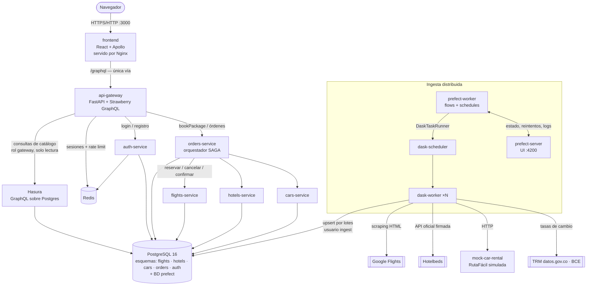
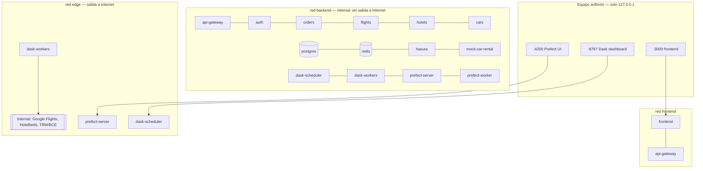
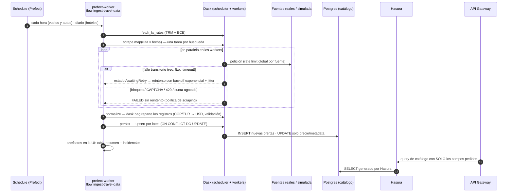

# Arquitectura — WanderSync Travel Solutions

WanderSync vende paquetes turísticos dinámicos (vuelo + hotel + auto). Este documento describe los
componentes, el despliegue, el flujo de datos y la justificación técnica de cada decisión.
Documentos relacionados: [SAGA](saga.md), [seguridad](seguridad/README.md),
[contratos](contratos/) y [fuentes de datos](fuentes/).

## 1. Vista de componentes



| Servicio | Tecnología | Responsabilidad | Datos |
|---|---|---|---|
| `frontend` | React 19 + Vite + TypeScript + Apollo Client, servido por Nginx | Búsqueda, armado del paquete, checkout, línea de tiempo de la SAGA | — |
| `api-gateway` | FastAPI + Strawberry GraphQL | **Único punto de entrada**: consultas de catálogo, mutaciones de reserva, sesiones, rate limiting | Redis |
| `auth-service` | FastAPI + Argon2id | Registro, login con rotación de sesión, logout | esquema `auth` + Redis |
| `flights-service`, `hotels-service`, `cars-service` | FastAPI + SQLAlchemy async | Catálogo e **inventario**; reservar/cancelar/confirmar idempotentes (participantes de la SAGA) | esquemas `flights`, `hotels`, `cars` |
| `orders-service` | FastAPI | Órdenes, pago simulado, facturación y **orquestador SAGA** | esquema `orders` |
| `hasura` | Hasura GraphQL Engine v2 | GraphQL **transparente** sobre el catálogo (requisito 3.3) | lee los esquemas de catálogo |
| `postgres` | PostgreSQL 16 | Persistencia; un esquema y un usuario por servicio | — |
| `redis` | Redis 7.4 | Sesiones del lado del servidor y contadores de rate limiting | — |
| `dask-scheduler` + `dask-worker` ×N | Dask Distributed | Ejecución paralela de scraping, normalización e ingesta | — |
| `prefect-server` + `prefect-worker` | Prefect 3 | Flows, schedules, reintentos, observabilidad (UI) | base de datos `prefect` (mismo Postgres) |
| `mock-car-rental` | FastAPI | Fuente **simulada** de autos (RutaFácil) con fallos, lentitud y paginación | — |

## 2. Vista de despliegue y redes

Todo se levanta con **un solo comando**: `docker compose up` (17 contenedores, todos con
*healthcheck* y `depends_on: condition: service_healthy`). Las migraciones de cada servicio, la
metadata de Hasura, los deployments de Prefect y la primera ingesta se aplican solos al arrancar.



- **`backend` es interna**: los microservicios, Postgres, Redis y Hasura no tienen salida a Internet
  ni puertos publicados.
- **`edge`** solo la usan los workers de Dask (scraping real) y los paneles de Prefect y Dask.
- `docker-compose.debug.yml` publica Postgres, la consola de Hasura y el gateway directo para
  desarrollo o para la demo; no se usa por defecto.
- Endurecimiento: usuarios no-root, `cap_drop: ALL`, `no-new-privileges`, sistema de archivos de solo
  lectura en servicios sin estado (ver [seguridad §4](seguridad/README.md#4-endurecimiento-de-contenedores-tarea-57)).
- Escalado: `docker compose up -d --scale dask-worker=4` (por defecto `DASK_WORKER_REPLICAS=3`).

## 3. Flujo de ingesta: fuentes → Prefect → Dask → Postgres → Hasura → Gateway



| Etapa | Qué hace | Dónde |
|---|---|---|
| Orquestación | Flow `ingest-travel-data` con subflows por catálogo; deployments con *schedule* registrados por `prefect.serve` | `data-pipeline/flows/ingest.py`, `flows/serve.py` |
| Distribución | `DaskTaskRunner` contra el scheduler externo: cada búsqueda es una tarea en un worker | `flows/ingest.py` (`dask_runner`) |
| Reintentos | `retries=3`, backoff exponencial con jitter, `retry_condition_fn` que **solo** reintenta fallos transitorios | `RETRY_POLICY` en `flows/ingest.py` |
| Ritmo por fuente | `rate_limit("scraper-<fuente>")`: límite **global** entre todos los workers (p. ej. 1 petición/5 s a Google Flights) | `ensure_rate_limits` |
| Cuota | Hotelbeds: 45 de 50 peticiones diarias, contador compartido en el volumen `ingest-state` | `scrapers/quota.py` |
| Normalización | `dask.bag` reparte los registros en el clúster; conversión a USD con las tasas del día | `ingestion/normalize.py` |
| Persistencia | Upsert por lotes; el inventario solo se escribe al insertar (la SAGA lo gestiona después) | `ingestion/persist.py` |
| Observabilidad | Estados, reintentos, logs y artefactos (resumen e incidencias) en la UI de Prefect; tareas en el dashboard de Dask | UI `:4200`, dashboard `:8787` |
| Arranque en frío | Si un catálogo está vacío al arrancar, `serve.py` lanza la primera ingesta sola | `bootstrap_first_ingestion` |

## 4. Fuentes de datos y política de scraping responsable

| Catálogo | Fuente | Tipo | Ficha |
|---|---|---|---|
| Vuelos | Google Flights | Scraping de HTML real (aria-labels) | [google-flights.md](fuentes/google-flights.md) |
| Hoteles | Hotelbeds (entorno de evaluación) | API oficial con firma SHA-256 | [hotelbeds.md](fuentes/hotelbeds.md) |
| Autos | RutaFácil | Servicio **simulado** (permitido por §3.1 del enunciado) | [rutafacil-simulada.md](fuentes/rutafacil-simulada.md) |

**Política** (se aplica en código, no solo en papel):

1. Solo rutas que el `robots.txt` de la fuente **no prohíbe**.
2. **Nunca** se saltan CAPTCHAs ni protecciones anti-bot: un desafío o un `429` se trata como
   bloqueo y **no se reintenta**.
3. Pocas peticiones y espaciadas: pausa mínima por fuente, límite global en Prefect aunque Dask tenga
   más hilos libres. (Google Flights exige un User-Agent de navegador, `SCRAPER_USER_AGENT`; con el de httpx responde "navegador no compatible".)
4. Si una fuente falla o cambia su HTML, el flow termina de forma controlada, reporta las incidencias
   y el catálogo conserva los últimos datos válidos.

**Registro de fuentes**: se evaluaron más de 25 fuentes, una por una (`robots.txt` y una única
petición de prueba). Kayak, Booking, Despegar, TripAdvisor, Rentalcars, Localiza y otras se descartaron
por prohibición en `robots.txt` o por protecciones anti-bot. El registro completo, con fechas y
motivos, está en [PROGRESO.md §1.4](../PROGRESO.md#14-fuentes-de-datos-scraping-real).

**Limitaciones conocidas**: el HTML de Google Flights puede cambiar sin aviso (las pruebas usan HTML
real guardado en `data-pipeline/tests/fixtures/` para detectarlo); el entorno de evaluación de
Hotelbeds limita a 50 peticiones diarias; las fuentes reales no publican cupos, así que el inventario
inicial lo asigna WanderSync (configurable) y desde ahí lo gestiona la SAGA.

## 5. API Gateway GraphQL sin over-fetching

- **Única vía**: Nginx sirve el frontend y reenvía `/graphql` al gateway (mismo origen); ningún otro
  servicio es accesible desde el navegador.
- **Consultas complejas de consolidación**: `searchPackages` combina vuelo + hotel + auto de un mismo
  destino y fechas y calcula el precio estimado en una sola consulta.
- **Sin over-fetching de extremo a extremo**:
  1. el frontend pide solo lo que pinta (fragments `FlightCard`, `HotelCard`, `CarCard` y tipos
     generados con GraphQL Codegen desde el contrato `docs/contratos/schema.graphql`);
  2. el gateway lee la selección de la consulta (`_selection_names`, incluyendo fragments) y le pide
     a Hasura **solo esas columnas** (lista blanca `FLIGHT_FIELDS`, `HOTEL_FIELDS`, `CAR_FIELDS`);
  3. los `DataLoader` agrupan las búsquedas por ID (evitan N+1 en órdenes y paquetes).
- **Mutaciones**: `register`, `login`, `logout`, `bookPackage`; `bookPackage` responde de inmediato
  con la orden `PENDING` y el frontend sigue la SAGA consultando `order(id)`.
- **Protección**: límite de profundidad, rate limiting y CSRF (ver [seguridad](seguridad/README.md)).

## 6. Justificación técnica del stack

| Decisión | Alternativas | Por qué |
|---|---|---|
| **Python 3.12 + FastAPI** en todo el backend | Node/NestJS, Java/Spring | Dask y Prefect son nativos de Python: un solo lenguaje para servicios y pipeline, con Pydantic, SQLAlchemy y pytest compartidos |
| **Microservicios con un esquema y un usuario de BD por servicio** | Una BD por contenedor | Aislamiento real de datos (*database-per-service* lógico con GRANTs por columna) sin multiplicar contenedores |
| **Strawberry GraphQL** en el gateway | Apollo Server, Graphene | Tipado con dataclasses, DataLoader incluido, integración nativa con FastAPI |
| **Hasura** como capa GraphQL sobre Postgres | Supabase (pg_graphql/PostgREST) | Cumple "integración transparente con GraphQL" con metadata versionada en Git (`infra/hasura/metadata`), permisos por rol y columna, y corre como un solo contenedor. Supabase autoalojado exige ~10 contenedores (auth, storage, realtime…) que el proyecto no usa |
| **SAGA orquestada** | Coreografía con broker | Ver [saga.md §6](saga.md#6-por-qué-orquestación-y-no-coreografía): flujo explícito, estado persistido, recuperación y demostración más clara |
| **Redis** | Sesiones JWT sin estado | Sesiones del lado del servidor permiten **regenerar y revocar** el ID (Session Fixation) y contadores atómicos compartidos para el rate limiting |
| **Dask Distributed** | Celery, Spark | Requisito obligatorio; además `dask.bag` reparte la normalización y su dashboard muestra el reparto en vivo |
| **Prefect 3 con `serve`** | Airflow | Requisito obligatorio; reintentos con condición, rate limits globales, artefactos y UI sin necesidad de work pools |
| **React + Apollo + Codegen** | Vue, Angular | Consultas tipadas desde el contrato y caché normalizada; los fragments evitan pedir campos de más |
| **Nginx sin privilegios** | Servir desde Vite | Imagen mínima no-root, cabeceras de seguridad y proxy de `/graphql` en el mismo origen (cookies `SameSite=Strict`) |
| **Fuente simulada para autos** | Scraping con navegador automatizado | Las 10 fuentes de autos evaluadas prohíben el scraping o usan anti-bot; §3.1 del enunciado permite servicios simulados |

## 7. Estructura del repositorio

```
├── docker-compose.yml          # despliegue completo (un comando)
├── docker-compose.debug.yml    # publica Postgres, consola de Hasura y gateway (desarrollo/demo)
├── services/
│   ├── api-gateway/            # GraphQL (Strawberry), sesiones, rate limiting
│   ├── auth-service/           # Argon2id, rotación de sesión
│   ├── flights-service/  hotels-service/  cars-service/   # catálogo + reservas (SAGA)
│   ├── orders-service/         # órdenes, pago, factura, orquestador SAGA
│   └── mock-car-rental/        # fuente simulada de autos
├── data-pipeline/              # flows de Prefect, scrapers, normalización e ingesta (imagen de Dask)
├── frontend/                   # React + Apollo + Nginx
├── libs/common/                # utilidades compartidas (reservas idempotentes, logging, migraciones)
├── infra/                      # init de Postgres y metadata de Hasura
├── tests/                      # e2e (SAGA), ingest (Prefect+Dask), security
├── scripts/                    # .env, pruebas, locks, auditoría
└── docs/                       # este documento, saga, seguridad, contratos, fuentes, guion de demo
```
