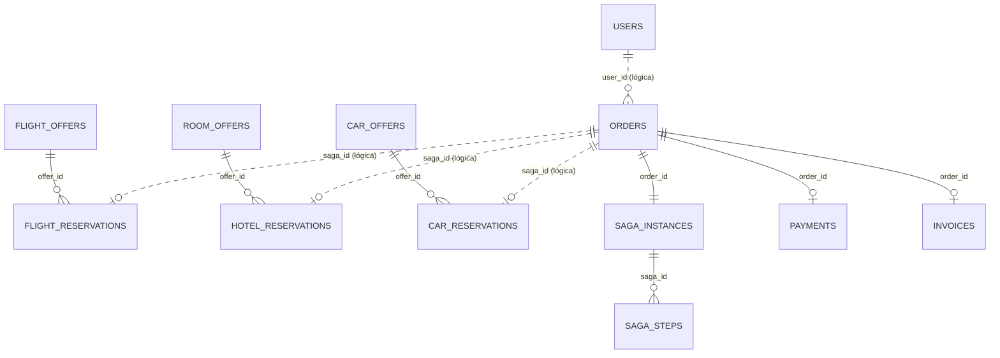

# Contrato — Modelo de datos

**Motor:** PostgreSQL 16 en una sola instancia con **un esquema por servicio**. Cada servicio tiene su propio usuario de base de datos con privilegios solo sobre su esquema. **No hay llaves foráneas entre esquemas**: las referencias entre servicios (por ejemplo `orders.orders.user_id`) son lógicas, igual que si cada servicio tuviera su propia base de datos.

Además de la base `wandersync`, la instancia aloja dos bases auxiliares: `hasura_metadata` (metadata interna de Hasura) y `prefect` (estado del servidor Prefect).

## Convenciones

| Aspecto | Regla |
|---|---|
| Llaves primarias | `UUID` con `DEFAULT gen_random_uuid()` |
| Fechas con hora | `TIMESTAMPTZ`, siempre en UTC |
| Fechas sin hora | `DATE` (check-in, recogida de auto, etc.) |
| Dinero | `NUMERIC(12,2)`. **Nunca `FLOAT`**. Todo el catálogo se normaliza a **USD** durante la ingesta; el precio tal como lo publicó la fuente se conserva en `price_original` + `currency_original` (trazabilidad del scraping) |
| Origen de los datos | Fuentes públicas reales (ver PROGRESO.md §1.4): **scraping** de HTML (`google-flights`) o **API oficial** (`hotelbeds`). `source` identifica la fuente |
| `external_id` | Identificador estable de la oferta dentro de su fuente. Si la fuente no publica uno, es un **hash SHA-1 de los campos que identifican la oferta** (definidos por catálogo más abajo). Junto con `source` es la llave del upsert |
| Inventario | El inventario inicial se fija **solo al insertar** una oferta nueva y desde ahí lo gestiona la SAGA. Si la fuente publica cupos (Hotelbeds: `allotment`) se usan; si no (Google Flights), se asignan `INGEST_DEFAULT_SEATS`, `INGEST_DEFAULT_ROOMS` o `INGEST_DEFAULT_CARS` |
| Moneda | `CHAR(3)` ISO 4217, valor por defecto `'USD'` |
| Ciudades y aeropuertos | `CHAR(3)` código IATA en mayúsculas (`BOG`, `MDE`, `CTG`…). Para hoteles y autos se usa el código IATA de la ciudad, así se cruzan con el destino del vuelo |
| Auditoría | Todas las tablas tienen `created_at` y `updated_at` (`TIMESTAMPTZ NOT NULL DEFAULT now()`) |
| Enums | `VARCHAR` + `CHECK`, no `CREATE TYPE`, porque son más fáciles de migrar con Alembic |
| Nombres | `snake_case` en la base de datos; `camelCase` en GraphQL |

## Diagrama



---

## Esquema `flights` — dueño: flights-service

### `flights.flight_offers` (catálogo, lo llena la ingesta)

Fuente: **Google Flights** (búsqueda solo ida por ruta y fecha).

| Columna | Tipo | Restricciones | Notas |
|---|---|---|---|
| `id` | UUID | PK | |
| `source` | VARCHAR(50) | NOT NULL | `google-flights` |
| `external_id` | VARCHAR(100) | NOT NULL | SHA-1 de `airline` + `origin` + `destination` + `departure_at` + `arrival_at` + `cabin_class` (Google Flights no publica un ID) |
| `airline` | VARCHAR(100) | NOT NULL | Aerolínea que vende el vuelo |
| `operated_by` | VARCHAR(100) | NULL | Aerolínea que lo opera, si es distinta (código compartido) |
| `flight_number` | VARCHAR(20) | NULL | **Opcional**: la fuente no siempre lo publica |
| `origin` | CHAR(3) | NOT NULL | IATA |
| `destination` | CHAR(3) | NOT NULL | IATA |
| `departure_at` | TIMESTAMPTZ | NOT NULL | |
| `arrival_at` | TIMESTAMPTZ | NOT NULL | `CHECK (arrival_at > departure_at)` |
| `stops` | SMALLINT | NOT NULL DEFAULT 0, `>= 0` | Número de escalas (0 = directo) |
| `cabin_class` | VARCHAR(20) | NOT NULL | `ECONOMY` \| `PREMIUM_ECONOMY` \| `BUSINESS` \| `FIRST` |
| `price` | NUMERIC(12,2) | NOT NULL, `> 0` | Precio **por pasajero** normalizado a USD |
| `currency` | CHAR(3) | NOT NULL DEFAULT `'USD'` | |
| `price_original` | NUMERIC(14,2) | NOT NULL, `> 0` | Precio tal como lo publicó la fuente (p. ej. `84390.00`) |
| `currency_original` | CHAR(3) | NOT NULL | Moneda de la fuente (p. ej. `COP`) |
| `seats_total` | INT | NOT NULL, `> 0` | Asignado por WanderSync al insertar (`INGEST_DEFAULT_SEATS`) |
| `seats_available` | INT | NOT NULL, `>= 0`, `<= seats_total` | **Inventario: solo lo modifica flights-service** |
| `scraped_at` | TIMESTAMPTZ | NOT NULL | Última vez que la ingesta vio la oferta |
| `created_at`, `updated_at` | TIMESTAMPTZ | NOT NULL | |

- `UNIQUE (source, external_id)`: llave de deduplicación para el upsert de la ingesta.
- Índice de búsqueda: `(origin, destination, departure_at)`.

### `flights.reservations`

| Columna | Tipo | Restricciones | Notas |
|---|---|---|---|
| `id` | UUID | PK | |
| `saga_id` | UUID | NOT NULL, **UNIQUE** | Llave de idempotencia: una reserva por SAGA |
| `order_id` | UUID | NULL | Referencia lógica a `orders.orders`; NULL solo en *tombstones* |
| `offer_id` | UUID | FK → `flight_offers.id`, NULL | NULL solo en *tombstones* |
| `quantity` | INT | NOT NULL, `>= 0` | Número de pasajeros (asientos); 0 en *tombstones* |
| `unit_price` | NUMERIC(12,2) | NULL | Precio tomado de la oferta **en el momento de reservar** |
| `total_price` | NUMERIC(12,2) | NULL | `unit_price * quantity` |
| `currency` | CHAR(3) | NOT NULL DEFAULT `'USD'` | |
| `status` | VARCHAR(20) | NOT NULL | `RESERVED` \| `CONFIRMED` \| `CANCELLED` |
| `created_at`, `updated_at` | TIMESTAMPTZ | NOT NULL | |

- `CHECK (status = 'CANCELLED' OR (offer_id IS NOT NULL AND quantity > 0))`.
- **Tombstone:** si llega una cancelación para un `saga_id` que no existe (por ejemplo, porque la reserva dio *timeout* y nunca se ejecutó), se inserta una fila `CANCELLED` sin oferta. Si la reserva original llega tarde, choca con el `UNIQUE(saga_id)` y se rechaza. Así una compensación nunca queda "por detrás" de la reserva que compensa.

---

## Esquema `hotels` — dueño: hotels-service

### `hotels.room_offers` (catálogo)

Fuente: **Hotelbeds**, API oficial (entorno de evaluación). Ver [docs/fuentes/hotelbeds.md](../fuentes/hotelbeds.md).

Una oferta es **un tipo de habitación con un régimen** (solo alojamiento, desayuno…) en un hotel, **para un rango de fechas concreto**. De cada combinación se guarda la tarifa más barata.

| Columna | Tipo | Restricciones | Notas |
|---|---|---|---|
| `id` | UUID | PK | |
| `source` | VARCHAR(50) | NOT NULL | `hotelbeds` |
| `external_id` | VARCHAR(100) | NOT NULL | `{código hotel}:{código habitación}:{código régimen}:{check_in}:{check_out}`, p. ej. `104915:DBL.SU:RO:2026-10-16:2026-10-19` |
| `hotel_code` | VARCHAR(20) | NOT NULL | Código del hotel en la fuente (`104915`) |
| `hotel_name` | VARCHAR(150) | NOT NULL | |
| `city_code` | CHAR(3) | NOT NULL | Código de destino de Hotelbeds, que coincide con el IATA de la ciudad (`MDE`, `CTG`…) |
| `zone_name` | VARCHAR(100) | NULL | Zona o barrio que informa la fuente |
| `address` | VARCHAR(255) | NULL | La API de disponibilidad no la entrega |
| `latitude`, `longitude` | NUMERIC(9,6) | NULL | Coordenadas del hotel |
| `stars` | SMALLINT | NULL, 1–5 | Se extrae de la categoría (`5EST` → 5). NULL si la categoría no es de estrellas (hostales, apartamentos) |
| `category_name` | VARCHAR(50) | NULL | Categoría original (`5 STARS`) |
| `rating` | NUMERIC(3,1) | NULL, 0–10 | La fuente no lo entrega |
| `room_code` | VARCHAR(30) | NOT NULL | Código de habitación de la fuente (`DBL.SU`) |
| `room_name` | VARCHAR(150) | NOT NULL | Nombre de la habitación (`SUPERIOR ROOM`) |
| `room_type` | VARCHAR(20) | NOT NULL | Derivado del prefijo del código: `SGL`→`SINGLE`, `DBL`→`DOUBLE`, `TWN`→`TWIN`, `SUI`/`JSU`→`SUITE`, `FAM`→`FAMILY`, otro→`OTHER` |
| `board_code` | VARCHAR(10) | NOT NULL | Régimen (`RO`, `BB`…) |
| `board_name` | VARCHAR(50) | NOT NULL | `ROOM ONLY`, `BED AND BREAKFAST`… |
| `max_guests` | SMALLINT | NOT NULL, `> 0` | Adultos de la tarifa consultada |
| `check_in` | DATE | NOT NULL | |
| `check_out` | DATE | NOT NULL | `CHECK (check_out > check_in)` |
| `nights` | SMALLINT | NOT NULL | Columna generada: `check_out - check_in` |
| `price_per_night` | NUMERIC(12,2) | NOT NULL, `> 0` | USD |
| `price_total` | NUMERIC(12,2) | NOT NULL | Precio **por habitación** de toda la estadía, en USD |
| `currency` | CHAR(3) | NOT NULL DEFAULT `'USD'` | |
| `price_original` | NUMERIC(14,2) | NOT NULL, `> 0` | Tarifa neta total de la estadía tal como la publica la fuente |
| `currency_original` | CHAR(3) | NOT NULL | `EUR` en el entorno de evaluación |
| `rooms_total` | INT | NOT NULL, `> 0` | **Cupo real de la fuente** (`allotment`) al insertar; si no viene, `INGEST_DEFAULT_ROOMS` |
| `rooms_available` | INT | NOT NULL, `>= 0`, `<= rooms_total` | **Inventario: solo lo modifica hotels-service** |
| `scraped_at`, `created_at`, `updated_at` | TIMESTAMPTZ | NOT NULL | `scraped_at` = momento de la consulta a la API |

- `UNIQUE (source, external_id)`; índices `(city_code, check_in, check_out)` y `(hotel_code)`.

### `hotels.reservations`

Misma estructura que `flights.reservations`. `quantity` = número de habitaciones.

---

## Esquema `cars` — dueño: cars-service

### `cars.car_offers` (catálogo)

> ⚠️ **Provisional hasta la tarea 2.7** (evaluación de la fuente de autos). Los campos que la fuente elegida no publique pasarán a ser opcionales.

| Columna | Tipo | Restricciones | Notas |
|---|---|---|---|
| `id` | UUID | PK | |
| `source` | VARCHAR(50) | NOT NULL | Por definir en la tarea 2.7 |
| `external_id` | VARCHAR(100) | NOT NULL | ID de la fuente o hash de `company` + `model` + `city_code` + `pickup_date` + `dropoff_date` |
| `company` | VARCHAR(100) | NOT NULL | |
| `model` | VARCHAR(100) | NOT NULL | |
| `category` | VARCHAR(20) | NOT NULL | `ECONOMY` \| `COMPACT` \| `SUV` \| `VAN` \| `LUXURY` |
| `transmission` | VARCHAR(10) | NOT NULL | `MANUAL` \| `AUTOMATIC` |
| `seats` | SMALLINT | NOT NULL | |
| `city_code` | CHAR(3) | NOT NULL | IATA de la ciudad de recogida |
| `pickup_date` | DATE | NOT NULL | |
| `dropoff_date` | DATE | NOT NULL | `CHECK (dropoff_date > pickup_date)` |
| `days` | SMALLINT | NOT NULL | Columna generada |
| `price_per_day` | NUMERIC(12,2) | NOT NULL, `> 0` | USD |
| `price_total` | NUMERIC(12,2) | NOT NULL | |
| `currency` | CHAR(3) | NOT NULL DEFAULT `'USD'` | |
| `price_original` | NUMERIC(14,2) | NOT NULL, `> 0` | Precio total tal como lo publicó la fuente |
| `currency_original` | CHAR(3) | NOT NULL | |
| `units_total` | INT | NOT NULL, `> 0` | Asignado por WanderSync al insertar (`INGEST_DEFAULT_CARS`) |
| `units_available` | INT | NOT NULL, `>= 0`, `<= units_total` | **Inventario: solo lo modifica cars-service** |
| `scraped_at`, `created_at`, `updated_at` | TIMESTAMPTZ | NOT NULL | |

- `UNIQUE (source, external_id)`; índice `(city_code, pickup_date, dropoff_date)`.

### `cars.reservations`

Misma estructura que `flights.reservations`. `quantity` = número de vehículos (siempre 1 en el MVP).

---

## Esquema `orders` — dueño: orders-service

### `orders.orders`

| Columna | Tipo | Restricciones | Notas |
|---|---|---|---|
| `id` | UUID | PK | |
| `user_id` | UUID | NOT NULL | Referencia lógica a `auth.users` |
| `idempotency_key` | VARCHAR(64) | NOT NULL | Generada por el frontend en cada intento de checkout |
| `status` | VARCHAR(20) | NOT NULL | `PENDING` \| `CONFIRMED` \| `CANCELLED` \| `FAILED` |
| `flight_offer_id` | UUID | NOT NULL | Referencia lógica |
| `hotel_offer_id` | UUID | NOT NULL | Referencia lógica |
| `car_offer_id` | UUID | NOT NULL | Referencia lógica |
| `passengers` | SMALLINT | NOT NULL, 1–9 | |
| `rooms` | SMALLINT | NOT NULL DEFAULT 1, 1–5 | |
| `subtotal` | NUMERIC(12,2) | NULL | Se calcula con los precios que devuelven las reservas |
| `taxes` | NUMERIC(12,2) | NULL | `subtotal * TAX_RATE` |
| `total_amount` | NUMERIC(12,2) | NULL | |
| `currency` | CHAR(3) | NOT NULL DEFAULT `'USD'` | |
| `created_at`, `updated_at` | TIMESTAMPTZ | NOT NULL | |

- `UNIQUE (user_id, idempotency_key)`: un doble clic en "Pagar" no crea dos órdenes.
- Índice `(user_id, created_at DESC)` para `myOrders`.
- **Los precios nunca vienen del cliente.** Los calcula cada servicio de dominio al reservar, lo que evita la manipulación de precios.

### `orders.saga_instances`

| Columna | Tipo | Restricciones | Notas |
|---|---|---|---|
| `id` | UUID | PK | Es el `saga_id` que se propaga a todos los servicios |
| `order_id` | UUID | FK → `orders.id`, UNIQUE | |
| `status` | VARCHAR(20) | NOT NULL | `STARTED` \| `COMPENSATING` \| `COMPLETED` \| `COMPENSATED` \| `FAILED` |
| `current_step` | VARCHAR(30) | NULL | Último paso en curso |
| `simulate_failure_at` | VARCHAR(20) | NULL | `FLIGHT` \| `HOTEL` \| `CAR` \| `PAYMENT` (solo con `ENABLE_FAULT_INJECTION=true`) |
| `failure_reason` | TEXT | NULL | |
| `version` | INT | NOT NULL DEFAULT 0 | Bloqueo optimista entre instancias del orquestador |
| `created_at`, `updated_at` | TIMESTAMPTZ | NOT NULL | |

- Índice parcial `WHERE status IN ('STARTED','COMPENSATING')`, que usa la recuperación de SAGAs al arrancar (tarea 3.5).

### `orders.saga_steps`

| Columna | Tipo | Restricciones | Notas |
|---|---|---|---|
| `id` | UUID | PK | |
| `saga_id` | UUID | FK → `saga_instances.id` | |
| `step` | VARCHAR(30) | NOT NULL | `RESERVE_FLIGHT` \| `RESERVE_HOTEL` \| `RESERVE_CAR` \| `PROCESS_PAYMENT` \| `CONFIRM_FLIGHT` \| `CONFIRM_HOTEL` \| `CONFIRM_CAR` \| `ISSUE_INVOICE` |
| `action` | VARCHAR(12) | NOT NULL | `EXECUTE` \| `COMPENSATE` |
| `status` | VARCHAR(12) | NOT NULL | `RUNNING` \| `SUCCEEDED` \| `FAILED` |
| `attempt` | SMALLINT | NOT NULL DEFAULT 1 | Se registra una fila por intento, para que los reintentos se vean en la línea de tiempo |
| `external_ref` | VARCHAR(100) | NULL | ID de reserva o de pago devuelto |
| `error_code` | VARCHAR(50) | NULL | |
| `error_message` | TEXT | NULL | |
| `started_at` | TIMESTAMPTZ | NOT NULL | |
| `finished_at` | TIMESTAMPTZ | NULL | |

- Índice `(saga_id, started_at)`.

### `orders.payments` (pago simulado)

| Columna | Tipo | Restricciones | Notas |
|---|---|---|---|
| `id` | UUID | PK | |
| `order_id` | UUID | FK → `orders.id` | |
| `saga_id` | UUID | NOT NULL, UNIQUE | Idempotencia |
| `amount` | NUMERIC(12,2) | NOT NULL | |
| `currency` | CHAR(3) | NOT NULL | |
| `status` | VARCHAR(12) | NOT NULL | `CAPTURED` \| `REFUNDED` \| `FAILED` |
| `provider_ref` | VARCHAR(64) | NULL | Referencia simulada, p. ej. `PAY-8F3A…` |
| `created_at`, `updated_at` | TIMESTAMPTZ | NOT NULL | |

### `orders.invoices`

| Columna | Tipo | Restricciones | Notas |
|---|---|---|---|
| `id` | UUID | PK | |
| `order_id` | UUID | FK → `orders.id`, UNIQUE | |
| `number` | VARCHAR(20) | NOT NULL, UNIQUE | `WS-000001`, generado desde una secuencia |
| `subtotal`, `taxes`, `total` | NUMERIC(12,2) | NOT NULL | |
| `currency` | CHAR(3) | NOT NULL | |
| `issued_at` | TIMESTAMPTZ | NOT NULL | |

La factura solo se emite cuando la SAGA termina con éxito (último paso, que es *retriable*).

---

## Esquema `auth` — dueño: auth-service

### `auth.users`

| Columna | Tipo | Restricciones | Notas |
|---|---|---|---|
| `id` | UUID | PK | |
| `email` | VARCHAR(254) | NOT NULL, UNIQUE | Se guarda normalizado en minúsculas |
| `full_name` | VARCHAR(120) | NOT NULL | |
| `password_hash` | TEXT | NOT NULL | Formato PHC de Argon2id: `$argon2id$v=19$m=65536,t=3,p=4$...` |
| `last_login_at` | TIMESTAMPTZ | NULL | |
| `created_at`, `updated_at` | TIMESTAMPTZ | NOT NULL | |

### Sesiones (Redis, no Postgres)

| Llave | Valor | TTL |
|---|---|---|
| `session:{session_id}` | Hash `{user_id, created_at, last_seen_at, ip, user_agent}` | `SESSION_IDLE_TIMEOUT_SECONDS`; se renueva en cada uso sin superar `SESSION_ABSOLUTE_TIMEOUT_SECONDS` desde `created_at` |
| `user_sessions:{user_id}` | Set de `session_id` | Permite cerrar todas las sesiones de un usuario |

`session_id` = `secrets.token_urlsafe(32)` (256 bits). **Se genera uno nuevo en cada login**, y cualquier sesión que traiga el cliente se destruye (mitigación de Session Fixation).

---

## Matriz de privilegios (la implementa la tarea 1.2)

| Usuario de BD | `flights` | `hotels` | `cars` | `orders` | `auth` |
|---|---|---|---|---|---|
| `flights_svc` | ALL (dueño) | — | — | — | — |
| `hotels_svc` | — | ALL (dueño) | — | — | — |
| `cars_svc` | — | — | ALL (dueño) | — | — |
| `orders_svc` | — | — | — | ALL (dueño) | — |
| `auth_svc` | — | — | — | — | ALL (dueño) |
| `ingest` (Dask) | `INSERT` + `UPDATE` **por columna** en `flight_offers` | ídem `room_offers` | ídem `car_offers` | — | — |
| `hasura_ro` | `SELECT` en `flight_offers` | `SELECT` en `room_offers` | `SELECT` en `car_offers` | — | — |

### Regla de la ingesta sobre el inventario

El upsert de la ingesta es:

```sql
-- Oferta nueva: el inventario inicial lo asigna WanderSync (seats_total = seats_available = INGEST_DEFAULT_SEATS)
INSERT INTO flights.flight_offers (..., seats_total, seats_available) VALUES (..., :default_seats, :default_seats)
-- Oferta ya conocida: solo se refrescan precio y metadata
ON CONFLICT (source, external_id) DO UPDATE
SET price = EXCLUDED.price, currency = EXCLUDED.currency,
    price_original = EXCLUDED.price_original, currency_original = EXCLUDED.currency_original,
    operated_by = EXCLUDED.operated_by, flight_number = EXCLUDED.flight_number,
    stops = EXCLUDED.stops, scraped_at = EXCLUDED.scraped_at, updated_at = now();
```

Los campos que forman el `external_id` (aerolínea, ruta, horarios y clase) no se actualizan: si cambian, es otra oferta.

**Nunca actualiza `seats_total` / `seats_available` ni sus equivalentes en hoteles y autos.** Si lo hiciera, cada ejecución del flow de Prefect borraría las reservas hechas por la SAGA. Esto se refuerza con privilegios por columna: `ingest` tiene `INSERT` sobre toda la tabla, pero `UPDATE` solo sobre las columnas de precio y metadata, así que Postgres rechaza el error aunque el código lo cometa.
