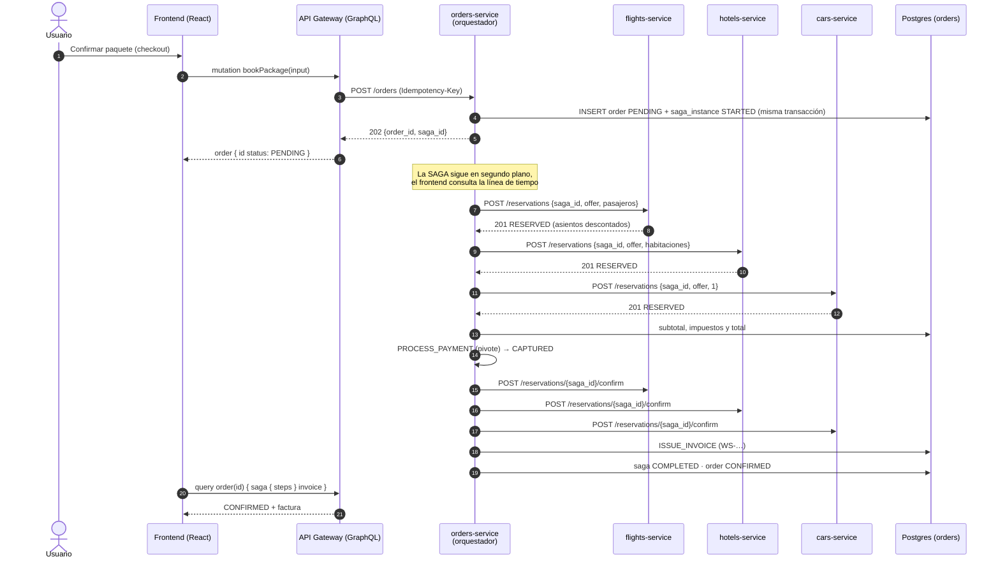
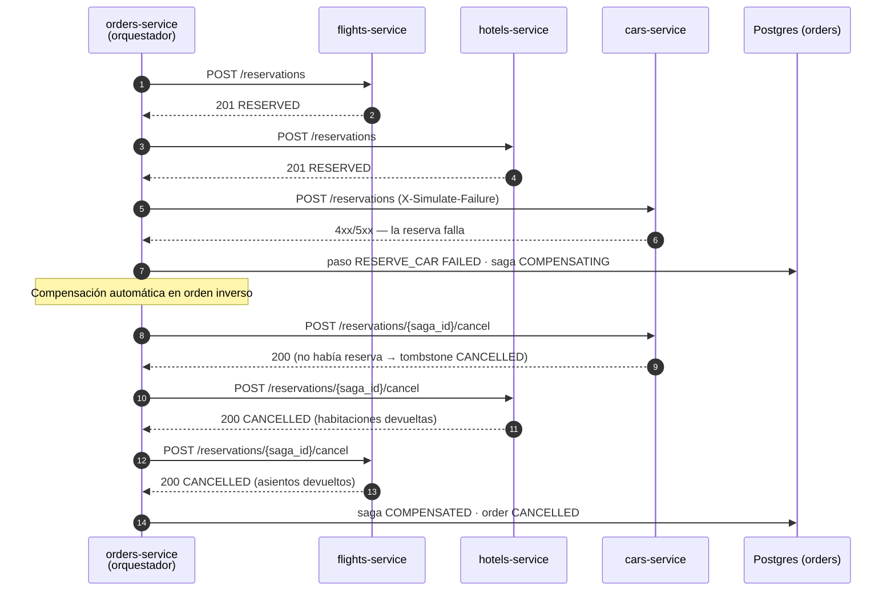
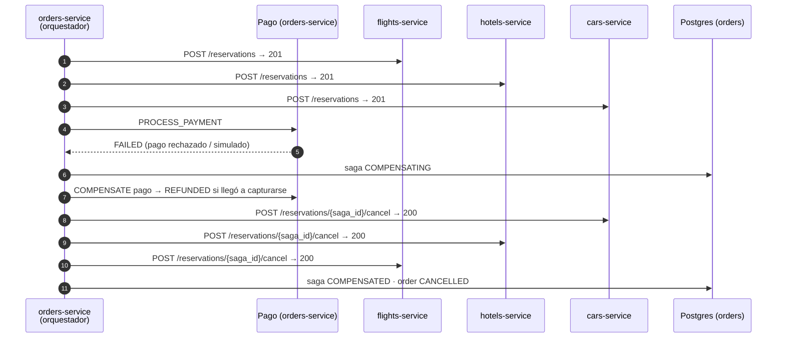

# Patrón SAGA — reserva de un paquete

La reserva de un paquete (vuelo + hotel + auto + pago) toca cuatro servicios con bases de datos
independientes, así que no existe una transacción ACID que la cubra. WanderSync la resuelve con una
**SAGA orquestada**: un orquestador dentro de `orders-service` ejecuta los pasos en orden, guarda el
estado de cada uno en Postgres y, si algo falla, ejecuta automáticamente las **transacciones de
compensación** en orden inverso. Así desaparecen las "reservas huérfanas" del enunciado (§2.2).

| Pieza | Archivo |
|---|---|
| Orquestador (pasos, reintentos, compensación) | `services/orders-service/app/saga.py` (`execute_saga`, `_run_step`, `_compensate`) |
| Recuperación tras un reinicio | `services/orders-service/app/saga.py` (`recover_pending_sagas`), invocada al arrancar en `app/main.py` |
| Inicio de la SAGA (orden + instancia en una transacción) | `services/orders-service/app/router.py` (`POST /orders`) |
| Reserva / cancelación / confirmación idempotentes en vuelos, hoteles y autos | `libs/common/wandersync_common/reservations.py` (router compartido por los tres servicios) |
| Estado persistido | tablas `orders.saga_instances` y `orders.saga_steps` |
| Mutación pública | `bookPackage` en `services/api-gateway/schema.py` |
| Línea de tiempo en vivo | `frontend/src/pages/OrderPage.tsx` (consulta `order { saga { steps } }` cada segundo) |

## 1. Pasos y compensaciones

| # | Paso | Tipo | Servicio | Acción | Compensación |
|---|---|---|---|---|---|
| 1 | `RESERVE_FLIGHT` | Compensable | flights-service | `POST /reservations` (descuenta asientos con `SELECT … FOR UPDATE`) | `POST /reservations/{saga_id}/cancel` → devuelve los asientos |
| 2 | `RESERVE_HOTEL` | Compensable | hotels-service | `POST /reservations` (descuenta habitaciones) | `…/cancel` → devuelve las habitaciones |
| 3 | `RESERVE_CAR` | Compensable | cars-service | `POST /reservations` (descuenta 1 auto) | `…/cancel` → devuelve el auto |
| 4 | `PROCESS_PAYMENT` | **Pivote** | orders-service | Captura el pago (simulado) | Reembolso: `payments.status = REFUNDED` |
| 5–7 | `CONFIRM_FLIGHT/HOTEL/CAR` | Reintentable | los tres catálogos | `POST /reservations/{saga_id}/confirm` | — (no se compensan: se reintentan hasta completarse) |
| 8 | `ISSUE_INVOICE` | Reintentable | orders-service | Emite la factura `WS-…` | — |

Reglas:

- **Antes del pivote**, si un paso falla se compensan **en orden inverso** todos los pasos de
  reserva, **incluido el que falló**: ante un timeout el orquestador no sabe si la reserva llegó a
  ejecutarse. Es seguro gracias al *tombstone* (abajo).
- **El pivote** (pago) es el punto de no retorno: si falla, se reembolsa (si llegó a capturarse) y
  se cancelan las tres reservas. Si tiene éxito, la SAGA ya no puede abortar.
- **Después del pivote**, las confirmaciones y la factura no se compensan: se reintentan sin límite
  (con backoff) hasta completarse.
- Errores: `4xx` = fallo de negocio → compensar sin reintentar; `5xx`, timeout o error de red =
  transitorio → reintentar con backoff exponencial hasta `SAGA_MAX_RETRIES` y luego compensar.

Estados: `saga_instances.status` = `STARTED → COMPLETED` o `STARTED → COMPENSATING → COMPENSATED`;
la orden pasa de `PENDING` a `CONFIRMED` o `CANCELLED`.

## 2. Camino exitoso (happy path)

## 3. Fallo en autos: compensación de hotel y vuelo

El inventario de las tres ofertas vuelve exactamente al valor previo; lo comprueba
`tests/e2e/test_saga.py`.

## 4. Fallo en el pago (pivote): reembolso y todas las cancelaciones

## 5. Garantías de consistencia

| Problema | Solución | Dónde |
|---|---|---|
| Doble clic / reintento del cliente crea dos órdenes | `Idempotency-Key` en `POST /orders`: la misma clave devuelve la misma orden | `orders-service/app/router.py` |
| El orquestador reintenta una reserva que sí se hizo | Reserva única por `saga_id` en cada servicio: repetirla devuelve la existente | `libs/common/wandersync_common/reservations.py` |
| Una cancelación llega **antes** que una reserva retrasada | La cancelación deja un **tombstone** `CANCELLED`; la reserva tardía responde `409 RESERVATION_CANCELLED` y no descuenta inventario | `reservations.py` |
| Dos SAGAs compiten por el último asiento | `SELECT … FOR UPDATE` sobre la oferta; sin cupo → `409 INSUFFICIENT_AVAILABILITY` (fallo de negocio → compensar) | `reservations.py` |
| La ingesta pisa el inventario reservado | El upsert solo actualiza precio y metadata; el usuario de BD `ingest` **no tiene permiso** de UPDATE sobre las columnas de inventario | `data-pipeline/ingestion/persist.py`, migraciones |
| El orquestador se cae a mitad de la SAGA | Estado persistido paso a paso; al arrancar, `recover_pending_sagas` retoma las SAGAs `STARTED`/`COMPENSATING` y marca los pasos interrumpidos como `ORCHESTRATOR_RESTARTED` | `saga.py` |
| Una compensación falla por la red | Las compensaciones se reintentan sin límite (backoff con tope); son idempotentes | `_compensate` en `saga.py` |

## 6. ¿Por qué orquestación y no coreografía?

| Criterio | Orquestación (elegida) | Coreografía |
|---|---|---|
| Visibilidad del flujo | Un solo lugar (`saga.py`) define el orden; el estado completo está en `saga_steps` y se muestra en la línea de tiempo | El flujo está repartido en suscripciones a eventos de cada servicio |
| Compensación | El orquestador sabe qué pasos se ejecutaron y compensa en orden inverso | Cada servicio debe escuchar los eventos de fallo y deducir qué deshacer |
| Infraestructura | HTTP interno; no requiere broker de mensajes | Requiere un broker (Kafka/RabbitMQ) y garantías de entrega |
| Recuperación tras caídas | Estado persistido → se retoma al arrancar | Depende de la reentrega de eventos |
| Acoplamiento | Los servicios de catálogo no se conocen entre sí; solo exponen reservar/cancelar/confirmar | Cada servicio conoce los eventos de los demás |
| Riesgo | El orquestador es un punto central (mitigado: estado persistido y recuperación) | Ciclos de eventos difíciles de depurar |

Con 4 participantes y un orden estricto (no se cobra antes de tener las tres reservas), la
orquestación es más simple de razonar, de probar y de **demostrar**: la línea de tiempo del
frontend muestra cada paso y cada compensación en vivo.

## 7. Cómo demostrarlo

- **Frontend:** en el checkout, el *Panel de demo · Simular fallo en* (`frontend/src/pages/CheckoutPage.tsx`) permite elegir `Ninguno`, `Vuelo`, `Hotel`,
  `Auto` o `Pago`. La página de la orden muestra la línea de tiempo con los pasos `EXECUTE` en verde,
  el fallo en rojo y las compensaciones `COMPENSATE`.
- **Prueba automatizada:** `tests/e2e/test_saga.py` ejecuta el happy path y los fallos en hotel,
  auto y pago a través del gateway, y verifica estados finales e inventario restaurado.
- **Base de datos:** `SELECT step, action, status, attempt FROM orders.saga_steps WHERE saga_id = '…' ORDER BY started_at;`
- **Configuración:** `ENABLE_FAULT_INJECTION=true` habilita la simulación (en producción va en
  `false` y el campo se ignora); `SAGA_STEP_DELAY_SECONDS=1` hace visible cada paso en la demo.
